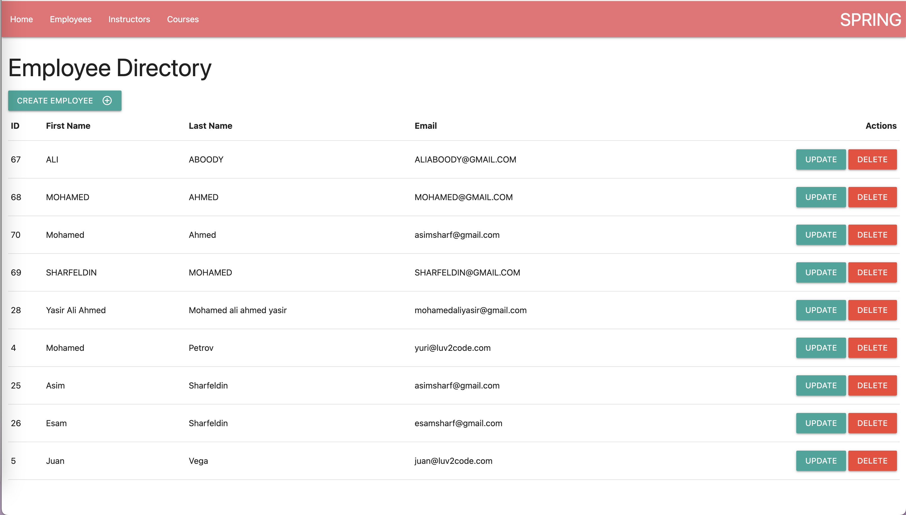
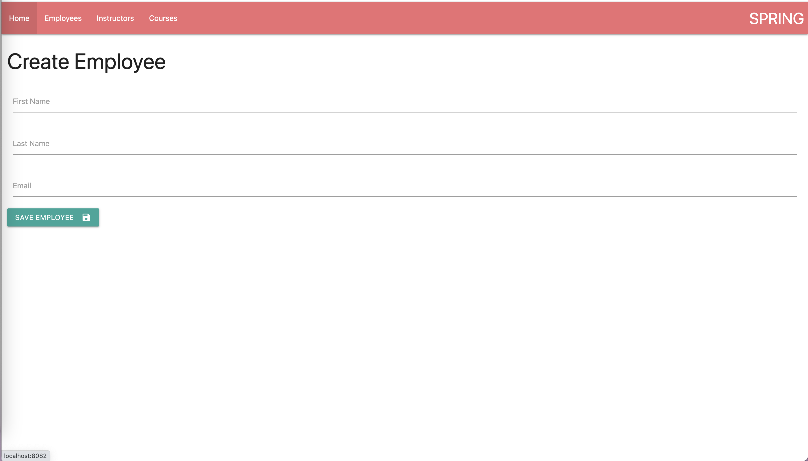
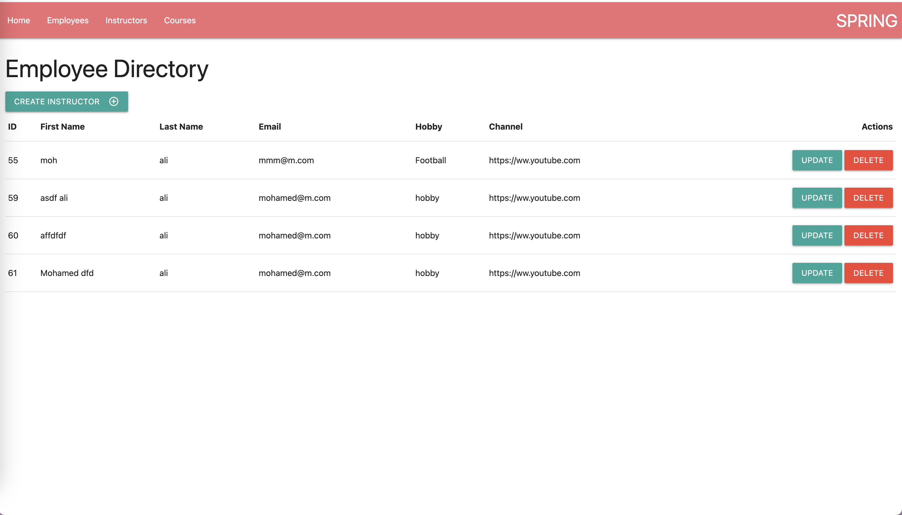
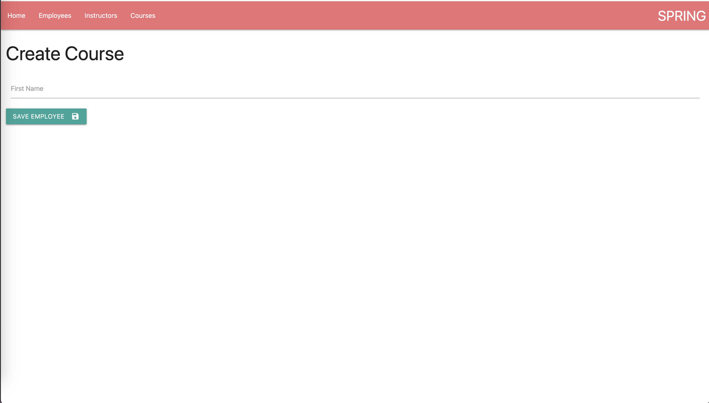
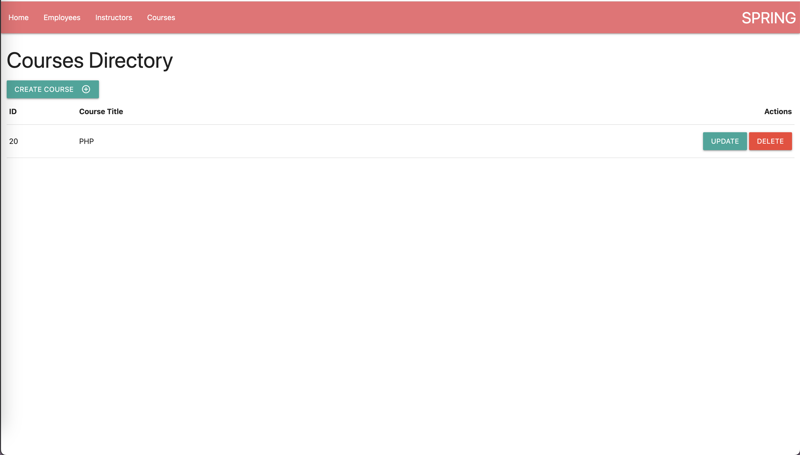
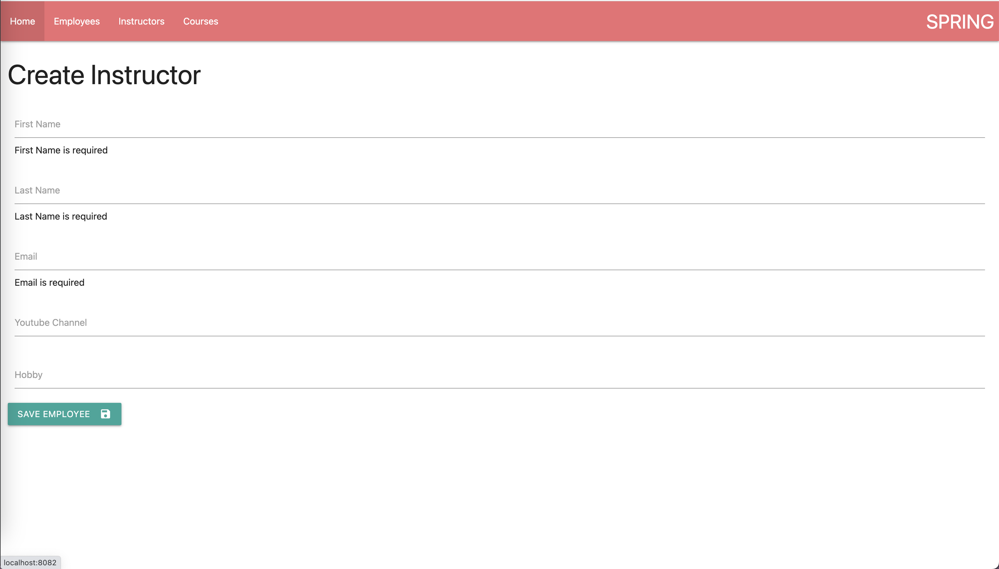
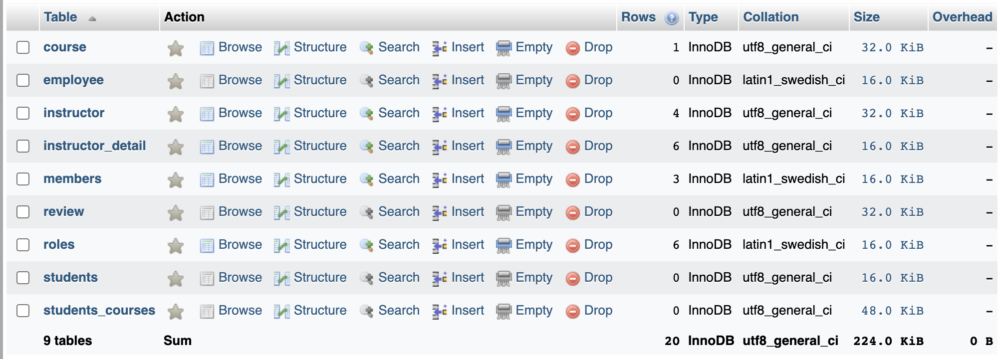

# Spring Demo Api

This is a demo api for the Spring framework.

### Installing

* Clone the repository

```
git clone https://github.com/asimsharf/spring-demo-api.git
cd spring-demo-api

mvn clean install
mvn test
mvn spring-boot:run

```

```agsl
javac -cp lombok.jar Main.java
javap Main.java
```








